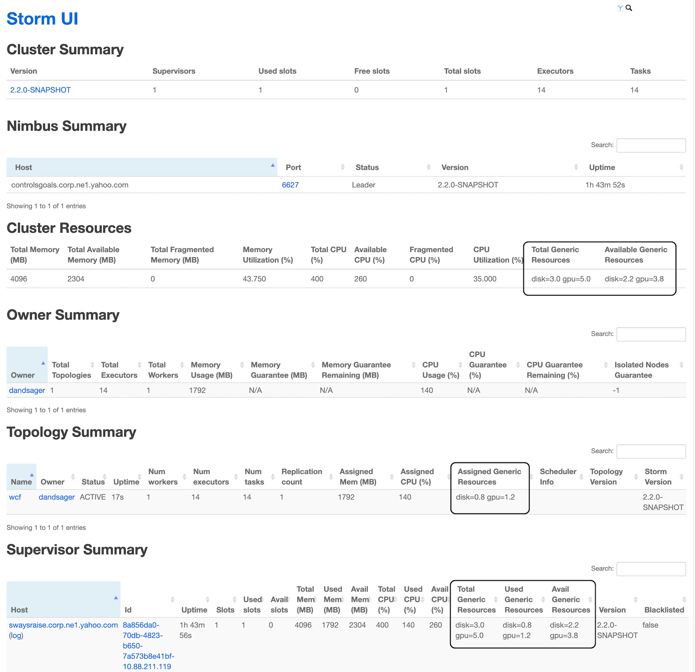

### Generic Resources
Generic Resources allow Storm to reference arbitrary resource types. Generic Resources may be considered an extension of the resources enumerated by the [Resource Aware Scheduler](Resource_Aware_Scheduler_overview.html), which accounts for CPU and memory.

### API Overview
For a Storm Topology, the user can now specify the amount of generic resources a topology component (i.e. Spout or Bolt) is required to run a single instance of the component. The user can specify the resource requirement for a topology component by using the following API call.
```
   public T addResource(String resourceName, Number resourceValue)
```
Parameters:
-   resourceName – The name of the generic resource
-   resourceValue – The amount of the generic resource

Example of Usage:
```
   SpoutDeclarer s1 = builder.setSpout("word", new TestWordSpout(), 10);
   s1.addResouce("gpu.count", 1.0);
```

### Specifying Generic Cluster Resources

A storm administrator can specify node resource availability by modifying the _conf/storm.yaml_ file located in the storm home directory of that node.
```
   supervisor.resources.map: {[type<String>] : [amount<Double>]}
```
Example of Usage:
```
   supervisor.resources.map: {"gpu.count" : 2.0}
```


### Generic Resources in UI


