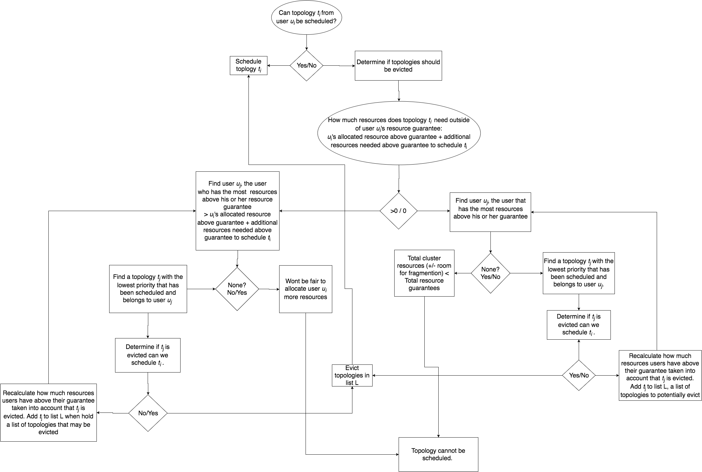
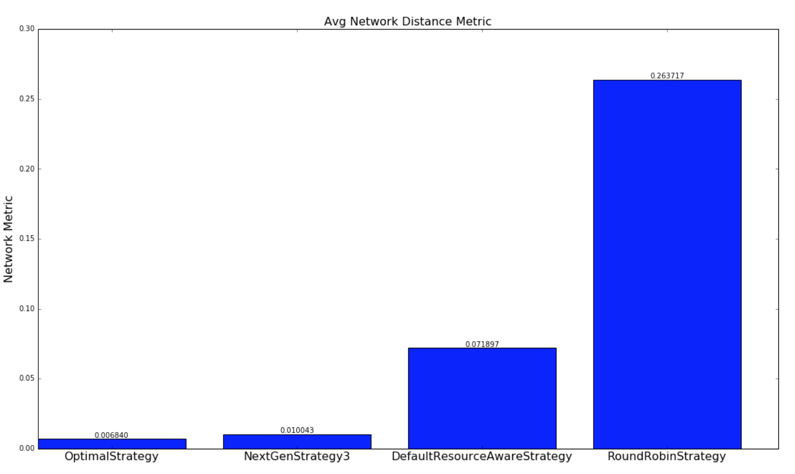
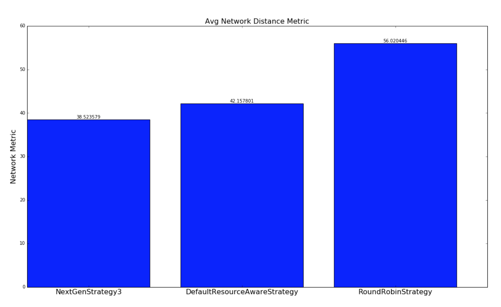
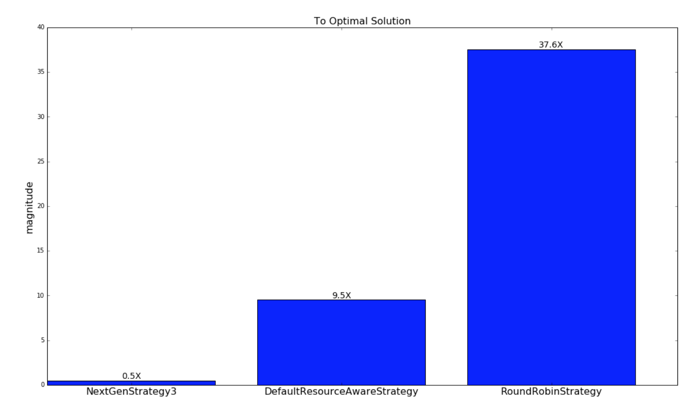
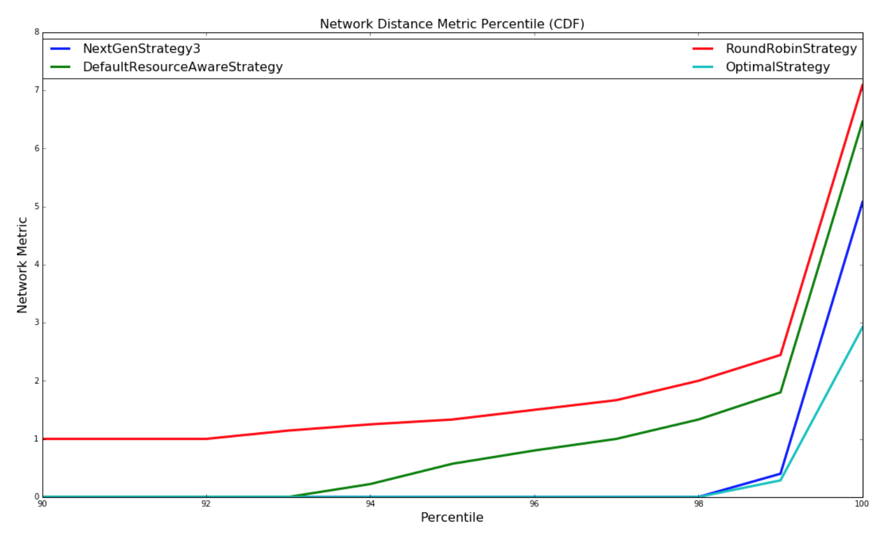
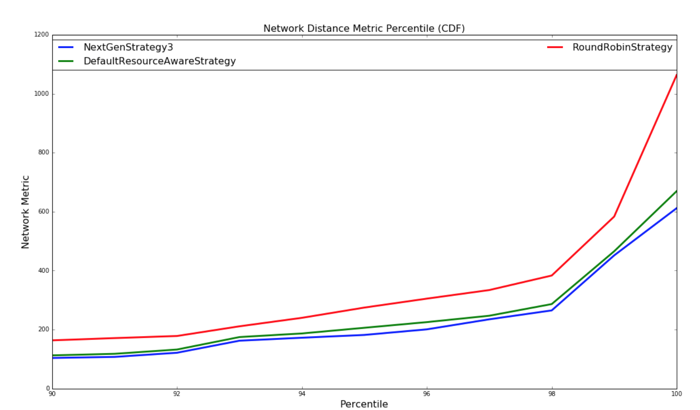
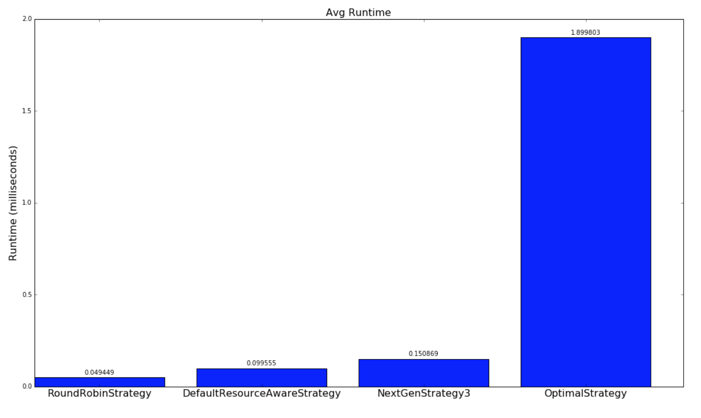
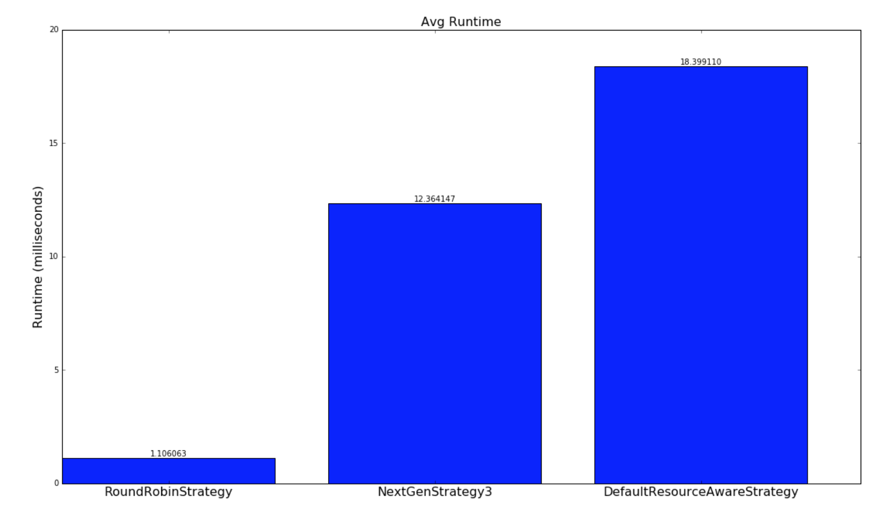

# Introduction

The purpose of this document is to provide a description of the Resource Aware Scheduler for the Storm distributed real-time computation system.  This document will provide you with both a high level description of the resource aware scheduler in Storm.  Some of the benefits are using a resource aware scheduler on top of Storm is outlined in the following presentation at Hadoop Summit 2016:

http://www.slideshare.net/HadoopSummit/resource-aware-scheduling-in-apache-storm

# Table of Contents
1. [Using Resource Aware Scheduler](#Using-Resource-Aware-Scheduler)
2. [API Overview](#API-Overview)
    1. [Setting Memory Requirement](#Setting-Memory-Requirement)
    2. [Shared Memory Requirement](#Setting-Shared-Memory)
    3. [Setting CPU Requirement](#Setting-CPU-Requirement)
    4. [Limiting the Heap Size per Worker (JVM) Process](#Limiting-the-Heap-Size-per-Worker-(JVM)Process)
    5. [Setting Available Resources on Node](#Setting-Available-Resources-on-Node)
    6. [Other Configurations](#Other-Configurations)
3. [Topology Priorities and Per User Resource](#Topology-Priorities-and-Per-User-Resource)
    1. [Setup](#Setup)
    2. [Specifying Topology Priority](#Specifying-Topology-Priority)
    3. [Specifying Scheduling Strategy](#Specifying-Scheduling-Strategy)
    4. [Specifying Topology Prioritization Strategy](#Specifying-Topology-Prioritization-Strategy)
    5. [Specifying Eviction Strategy](#Specifying-Eviction-Strategy)
4. [Profiling Resource Usage](#Profiling-Resource-Usage)
5. [Enhancements on original DefaultResourceAwareStrategy](#Enhancements-on-original-DefaultResourceAwareStrategy)

<div id='Using-Resource-Aware-Scheduler'/>
## Using Resource Aware Scheduler

The user can switch to using the Resource Aware Scheduler by setting the following in *conf/storm.yaml*
```
    storm.scheduler: “org.apache.storm.scheduler.resource.ResourceAwareScheduler”
```    
<div id='API-Overview'/>
## API Overview

For use with Trident, please see the [Trident RAS API](Trident-RAS-API.html)

For a Storm Topology, the user can now specify the amount of resources a topology component (i.e. Spout or Bolt) is required to run a single instance of the component.  The user can specify the resource requirement for a topology component by using the following API calls.

<div id='Setting-Memory-Requirement'/>
### Setting Memory Requirement

API to set component memory requirement:
```
    public T setMemoryLoad(Number onHeap, Number offHeap)
```
Parameters:
* Number onHeap – The amount of on heap memory an instance of this component will consume in megabytes
* Number offHeap – The amount of off heap memory an instance of this component will consume in megabytes

The user also has to option to just specify the on heap memory requirement if the component does not have an off heap memory need.
```
    public T setMemoryLoad(Number onHeap)
```
Parameters:
* Number onHeap – The amount of on heap memory an instance of this component will consume

If no value is provided for offHeap, 0.0 will be used. If no value is provided for onHeap, or if the API is never called for a component, the default value will be used.

Example of Usage:
```
    SpoutDeclarer s1 = builder.setSpout("word", new TestWordSpout(), 10);
    s1.setMemoryLoad(1024.0, 512.0);
    builder.setBolt("exclaim1", new ExclamationBolt(), 3)
                .shuffleGrouping("word").setMemoryLoad(512.0);
```
The entire memory requested for this topology is 16.5 GB. That is from 10 spouts with 1GB on heap memory and 0.5 GB off heap memory each and 3 bolts with 0.5 GB on heap memory each.

<div id='Setting-Shared-Memory'/>
### Shared Memory

In some cases you may have memory that is shared between components. It may be a as simple as a large static data structure, or as complex as static data that is memory mapped into a bolt and is shared accross workers.  In any case you can specify your shared memory request by
creating one of `SharedOffHeapWithinNode`, `SharedOffHeapWithinWorker`, or `SharedOnHeap` and adding it to bolts and spouts that use that shared memory.

Example of Usage:

```
 builder.setBolt("exclaim1", new ExclamationBolt(), 3).shuffleGrouping("word")
          .addSharedMemory(new SharedOnHeap(100, "exclaim-cache"));
```

In the above example all of the "exclaim1" bolts in a worker will share 100MB of memory.

```
 builder.setBolt("lookup", new LookupBolt(), 3).shuffleGrouping("spout")
          .addSharedMemory(new SharedOffHeapWithinNode(500, "static-lookup"));
```

In this example all "lookup" bolts on a given node will share 500 MB or memory off heap. 


<div id='Setting-CPU-Requirement'/>
### Setting CPU Requirement

API to set component CPU requirement:
```
    public T setCPULoad(Double amount)
```
Parameters:
* Number amount – The amount of on CPU an instance of this component will consume.

Currently, the amount of CPU resources a component requires or is available on a node is represented by a point system. CPU usage is a difficult concept to define. Different CPU architectures perform differently depending on the task at hand. They are so complex that expressing all of that in a single precise portable number is impossible. Instead we take a convention over configuration approach and are primarily concerned with rough level of CPU usage while still providing the possibility to specify amounts more fine grained.

By convention a CPU core typically will get 100 points. If you feel that your processors are more or less powerful you can adjust this accordingly. Heavy tasks that are CPU bound will get 100 points, as they can consume an entire core. Medium tasks should get 50, light tasks 25, and tiny tasks 10. In some cases you have a task that spawns other threads to help with processing. These tasks may need to go above 100 points to express the amount of CPU they are using. If these conventions are followed the common case for a single threaded task the reported Capacity * 100 should be the number of CPU points that the task needs.

Example of Usage:
```
    SpoutDeclarer s1 = builder.setSpout("word", new TestWordSpout(), 10);
    s1.setCPULoad(15.0);
    builder.setBolt("exclaim1", new ExclamationBolt(), 3)
                .shuffleGrouping("word").setCPULoad(10.0);
    builder.setBolt("exclaim2", new HeavyBolt(), 1)
                    .shuffleGrouping("exclaim1").setCPULoad(450.0);
```
<div id='Limiting-the-Heap-Size-per-Worker-(JVM)Process'/>
###	Limiting the Heap Size per Worker (JVM) Process
```
    public void setTopologyWorkerMaxHeapSize(Number size)
```
Parameters:
* Number size – The memory limit a worker process will be allocated in megabytes

The user can limit the amount of memory resources the resource aware scheduler allocates to a single worker on a per topology basis by using the above API.  This API is in place so that the users can spread executors to multiple workers.  However, spreading executors to multiple workers may increase the communication latency since executors will not be able to use Disruptor Queue for intra-process communication.

Example of Usage:
```
    Config conf = new Config();
    conf.setTopologyWorkerMaxHeapSize(512.0);
```
<div id='Setting-Available-Resources-on-Node'/>
### Setting Available Resources on Node

A storm administrator can specify node resource availability by modifying the *conf/storm.yaml* file located in the storm home directory of that node.

A storm administrator can specify how much available memory a node has in megabytes adding the following to *storm.yaml*
```
    supervisor.memory.capacity.mb: [amount<Double>]
```
A storm administrator can also specify how much available CPU resources a node has available adding the following to *storm.yaml*
```
    supervisor.cpu.capacity: [amount<Double>]
```

Note: that the amount the user can specify for the available CPU is represented using a point system like discussed earlier.

Example of Usage:
```
    supervisor.memory.capacity.mb: 20480.0
    supervisor.cpu.capacity: 100.0
```
<div id='Other-Configurations'/>
### Other Configurations

The user can set some default configurations for the Resource Aware Scheduler in *conf/storm.yaml*:
```
    //default value if on heap memory requirement is not specified for a component 
    topology.component.resources.onheap.memory.mb: 128.0

    //default value if off heap memory requirement is not specified for a component 
    topology.component.resources.offheap.memory.mb: 0.0

    //default value if CPU requirement is not specified for a component 
    topology.component.cpu.pcore.percent: 10.0

    //default value for the max heap size for a worker  
    topology.worker.max.heap.size.mb: 768.0
```
<div id='Topology-Priorities-and-Per-User-Resource'/>
## Topology Priorities and Per User Resource 

The Resource Aware Scheduler or RAS also has multitenant capabilities since many Storm users typically share a Storm cluster.  Resource Aware Scheduler can allocate resources on a per user basis.  Each user can be guaranteed a certain amount of resources to run his or her topologies and the Resource Aware Scheduler will meet those guarantees when possible.  When the Storm cluster has extra free resources, Resource Aware Scheduler will to be able allocate additional resources to user in a fair manner. The importance of topologies can also vary.  Topologies can be used for actual production or just experimentation, thus Resource Aware Scheduler will take into account the importance of a topology when determining the order in which to schedule topologies or when to evict topologies

<div id='Setup'/>
### Setup

The resource guarantees of a user can be specified *conf/user-resource-pools.yaml*.  Specify the resource guarantees of a user in the following format:
```
    resource.aware.scheduler.user.pools:
	[UserId]
		cpu: [Amount of Guarantee CPU Resources]
		memory: [Amount of Guarantee Memory Resources]
```
An example of what *user-resource-pools.yaml* can look like:
```
    resource.aware.scheduler.user.pools:
        jerry:
            cpu: 1000
            memory: 8192.0
        derek:
            cpu: 10000.0
            memory: 32768
        bobby:
            cpu: 5000.0
            memory: 16384.0
```
Please note that the specified amount of Guaranteed CPU and Memory can be either a integer or double

<div id='Specifying-Topology-Priority'/>
### Specifying Topology Priority
The range of topology priorities can range form 0-29.  The topologies priorities will be partitioned into several priority levels that may contain a range of priorities. 
For example we can create a priority level mapping:

    PRODUCTION => 0 – 9
    STAGING => 10 – 19
    DEV => 20 – 29

Thus, each priority level contains 10 sub priorities. Users can set the priority level of a topology by using the following API
```
    conf.setTopologyPriority(int priority)
``` 
Parameters:
* priority – an integer representing the priority of the topology

Please note that the 0-29 range is not a hard limit.  Thus, a user can set a priority number that is higher than 29. However, the property of higher the priority number, lower the importance still holds

<div id='Specifying-Scheduling-Strategy'/>
### Specifying Scheduling Strategy

A user can specify on a per topology basis what scheduling strategy to use.  Users can implement the IStrategy interface and define new strategies to schedule specific topologies.  This pluggable interface was created since we realize different topologies might have different scheduling needs.  A user can set the topology strategy within the topology definition by using the API:
```
    public void setTopologyStrategy(Class<? extends IStrategy> clazz)
```
Parameters:
* clazz – The strategy class that implements the IStrategy interface

Example Usage:
```
    conf.setTopologyStrategy(org.apache.storm.scheduler.resource.strategies.scheduling.DefaultResourceAwareStrategy.class);
```
A default scheduling is provided.  The DefaultResourceAwareStrategy is implemented based off the scheduling algorithm in the original paper describing resource aware scheduling in Storm:

Peng, Boyang, Mohammad Hosseini, Zhihao Hong, Reza Farivar, and Roy Campbell. "R-storm: Resource-aware scheduling in storm." In Proceedings of the 16th Annual Middleware Conference, pp. 149-161. ACM, 2015.

http://dl.acm.org/citation.cfm?id=2814808

**Please Note: Enhancements have to made on top of the original scheduling strategy as described in the paper.  Please see section "Enhancements on original DefaultResourceAwareStrategy"**

<div id='Specifying-Topology-Prioritization-Strategy'/>
### Specifying Topology Prioritization Strategy

The order of scheduling is a pluggable interface in which a user could define a strategy that prioritizes topologies.  For a user to define his or her own prioritization strategy, he or she needs to implement the ISchedulingPriorityStrategy interface.  A user can set the scheduling priority strategy by setting the *Config.RESOURCE_AWARE_SCHEDULER_PRIORITY_STRATEGY* to point to the class that implements the strategy. For instance:
```
    resource.aware.scheduler.priority.strategy: "org.apache.storm.scheduler.resource.strategies.priority.DefaultSchedulingPriorityStrategy"
```
A default strategy will be provided.  The following explains how the default scheduling priority strategy works.

**DefaultSchedulingPriorityStrategy**

The order of scheduling should be based on the distance between a user’s current resource allocation and his or her guaranteed allocation.  We should prioritize the users who are the furthest away from their resource guarantee. The difficulty of this problem is that a user may have multiple resource guarantees, and another user can have another set of resource guarantees, so how can we compare them in a fair manner?  Let's use the average percentage of resource guarantees satisfied as a method of comparison.

For example:

|User|Resource Guarantee|Resource Allocated|
|----|------------------|------------------|
|A|<10 CPU, 50GB>|<2 CPU, 40 GB>|
|B|< 20 CPU, 25GB>|<15 CPU, 10 GB>|

User A’s average percentage satisfied of resource guarantee: 

(2/10+40/50)/2  = 0.5

User B’s average percentage satisfied of resource guarantee: 

(15/20+10/25)/2  = 0.575

Thus, in this example User A has a smaller average percentage of his or her resource guarantee satisfied than User B.  Thus, User A should get priority to be allocated more resource, i.e., schedule a topology submitted by User A.

When scheduling, RAS sorts users by the average percentage satisfied of resource guarantee and schedule topologies from users based on that ordering starting from the users with the lowest average percentage satisfied of resource guarantee.  When a user’s resource guarantee is completely satisfied, the user’s average percentage satisfied of resource guarantee will be greater than or equal to 1.

<div id='Specifying-Eviction-Strategy'/>
### Specifying Eviction Strategy
The eviction strategy is used when there are not enough free resources in the cluster to schedule new topologies. If the cluster is full, we need a mechanism to evict topologies so that user resource guarantees can be met and additional resource can be shared fairly among users. The strategy for evicting topologies is also a pluggable interface in which the user can implement his or her own topology eviction strategy.  For a user to implement his or her own eviction strategy, he or she needs to implement the IEvictionStrategy Interface and set *Config.RESOURCE_AWARE_SCHEDULER_EVICTION_STRATEGY* to point to the implemented strategy class. For instance:
```
    resource.aware.scheduler.eviction.strategy: "org.apache.storm.scheduler.resource.strategies.eviction.DefaultEvictionStrategy"
```
A default eviction strategy is provided.  The following explains how the default topology eviction strategy works

**DefaultEvictionStrategy**

To determine if topology eviction should occur we should take into account the priority of the topology that we are trying to schedule and whether the resource guarantees for the owner of the topology have been met.  

We should never evict a topology from a user that does not have his or her resource guarantees satisfied.  The following flow chart should describe the logic for the eviction process.



<div id='Profiling-Resource-Usage'/>
## Profiling Resource Usage

Figuring out resource usage for your topology:
 
To get an idea of how much memory/CPU your topology is actually using you can add the following to your topology launch code.
 ```
    //Log all storm metrics
    conf.registerMetricsConsumer(backtype.storm.metric.LoggingMetricsConsumer.class);
 
    //Add in per worker CPU measurement
    Map<String, String> workerMetrics = new HashMap<String, String>();
    workerMetrics.put("CPU", "org.apache.storm.metrics.sigar.CPUMetric");
    conf.put(Config.TOPOLOGY_WORKER_METRICS, workerMetrics);
```
The CPU metrics will require you to add
``` 
    <dependency>
        <groupId>org.apache.storm</groupId>
        <artifactId>storm-metrics</artifactId>
        <version>1.0.0</version>
    </dependency>
```
as a topology dependency (1.0.0 or higher).
 
You can then go to your topology on the UI, turn on the system metrics, and find the log that the LoggingMetricsConsumer is writing to.  It will output results in the log like.
```
    1454526100 node1.nodes.com:6707 -1:__system CPU {user-ms=74480, sys-ms=10780}
    1454526100 node1.nodes.com:6707 -1:__system memory/nonHeap     {unusedBytes=2077536, virtualFreeBytes=-64621729, initBytes=2555904, committedBytes=66699264, maxBytes=-1, usedBytes=64621728}
    1454526100 node1.nodes.com:6707 -1:__system memory/heap  {unusedBytes=573861408, virtualFreeBytes=694644256, initBytes=805306368, committedBytes=657719296, maxBytes=778502144, usedBytes=83857888}
```
The metrics with -1:__system are generally metrics for the entire worker.  In the example above that worker is running on node1.nodes.com:6707.  These metrics are collected every 60 seconds.  For the CPU you can see that over the 60 seconds this worker used  74480 + 10780 = 85260 ms of CPU time.  This is equivalent to 85260/60000 or about 1.5 cores.
 
The Memory usage is similar but look at the usedBytes.  offHeap is 64621728 or about 62MB, and onHeap is 83857888 or about 80MB, but you should know what you set your heap to in each of your workers already.  How do you divide this up per bolt/spout?  That is a bit harder and may require some trial and error from your end.

<div id='Enhancements-on-original-DefaultResourceAwareStrategy'/>
## * Enhancements on original DefaultResourceAwareStrategy *

The default resource aware scheduling strategy as described in the paper above has two main scheduling phases:

1. Task Selection - Calculate the order task/executors in a topology should be scheduled
2. Node Selection - Given a task/executor, find a node to schedule the task/executor on.

Enhancements have been made for both scheduling phases

### Task Selection Enhancements 

Instead of using a breadth first traversal of the topology graph to create a ordering of components and its executors, a new heuristic is used that orders components by the number of in and out edges (potential connections) of the component.  This is discovered to be a more effective way to colocate executors that communicate with each other and reduce the network latency.


### Node Selection Enhancements

Node selection comes down first selecting which rack (server rack) and then which node on that rack to choose. The gist of strategy in choosing a rack and node is finding the rack that has the "most" resource available and in that rack find the node with the "most" free resources.  The assumption we are making for this strategy is that the node or rack with the most free resources will have the highest probability that allows us to schedule colocate the most number of executors on the node or rack to reduce network communication latency

Racks and nodes will be sorted from best choice to worst choice.  When finding an executor, the strategy will iterate through all racks and nodes, starting from best to worst, before giving up.  Racks and nodes will be sorted in the following matter:

1. How many executors are already scheduled on the rack or node  
 -- This is done so we move executors to schedule closer to executors that are already scheduled and running.  If a topology partially crashed and a subset of the topology's executors need to be rescheduled, we want to reschedule these executors as close (network wise) as possible to the executors that healthy and running. 

2. Subordinate resource availability or the amount "effective" resources on the rack or node  
 -- Please refer the section on Subordinate Resource Availability

3. Average of the all the resource availability  
 -- This is simply taking the average of the percent available (available resources on node or rack divied by theavailable resources on rack or cluster, repectively).  This situation will only be used when "effective resources" for two objects (rack or node) are the same. Then we consider the average of all the percentages of resources as a metric for sorting. For example:
```
        Avail Resources:
        node 1: CPU = 50 Memory = 1024 Slots = 20
        node 2: CPU = 50 Memory = 8192 Slots = 40
        node 3: CPU = 1000 Memory = 0 Slots = 0

        Effective resources for nodes:
        node 1 = 50 / (50+50+1000) = 0.045 (CPU bound)
        node 2 = 50 / (50+50+1000) = 0.045 (CPU bound)
        node 3 = 0 (memory and slots are 0)
```
ode 1 and node 2 have the same effective resources but clearly node 2 has more resources (memory and slots) than node 1 and we would want to pick node 2 first since there is a higher probability we will be able to schedule more executors on it. This is what the phase 2 averaging does

Thus the sorting follows the following progression. Compare based on 1) and if equal then compare based on 2) and if equal compare based on 3) and if equal we break ties by arbitrarly assigning ordering based on comparing the ids of the node or rack.

**Subordinate Resource Availability**

Originally the getBestClustering algorithm for RAS finds the "Best" rack based on which rack has the "most available" resources by finding the rack with the biggest sum of available memory + available across all nodes in the rack. This method is not very accurate since memory and cpu usage aree values on a different scale and the values are not normailized. This method is also not effective since it does not consider the number of slots available and it fails to identifying racks that are not schedulable due to the exhaustion of one of the resources either memory, cpu, or slots. Also the previous method does not consider failures of workers. When executors of a topology gets unassigned and needs to be scheduled again, the current logic in getBestClustering may be inadequate since it will likely return a cluster that is different from where the majority of executors from the topology is originally scheduling in.

The new strategy/algorithm to find the "best" rack or node, I dub subordinate resource availability ordering (inspired by Dominant Resource Fairness), sorts racks and nodes by the subordinate (not dominant) resource availability.

For example given 4 racks with the following resource availabilities
```
    //generate some that has alot of memory but little of cpu
    rack-3 Avail [ CPU 100.0 MEM 200000.0 Slots 40 ] Total [ CPU 100.0 MEM 200000.0 Slots 40 ]
    //generate some supervisors that are depleted of one resource
    rack-2 Avail [ CPU 0.0 MEM 80000.0 Slots 40 ] Total [ CPU 0.0 MEM 80000.0 Slots 40 ]
    //generate some that has a lot of cpu but little of memory
    rack-4 Avail [ CPU 6100.0 MEM 10000.0 Slots 40 ] Total [ CPU 6100.0 MEM 10000.0 Slots 40 ]
    //generate another rack of supervisors with less resources than rack-0
    rack-1 Avail [ CPU 2000.0 MEM 40000.0 Slots 40 ] Total [ CPU 2000.0 MEM 40000.0 Slots 40 ]
    //best rack to choose
    rack-0 Avail [ CPU 4000.0 MEM 80000.0 Slots 40( ] Total [ CPU 4000.0 MEM 80000.0 Slots 40 ]
    Cluster Overall Avail [ CPU 12200.0 MEM 410000.0 Slots 200 ] Total [ CPU 12200.0 MEM 410000.0 Slots 200 ]
```
It is clear that rack-0 is the best cluster since its the most balanced and can potentially schedule the most executors, while rack-2 is the worst rack since rack-2 is depleted of cpu resource thus rendering it unschedulable even though there are other resources available.

We first calculate the resource availability percentage of all the racks for each resource by computing:

    (resource available on rack) / (resource available in cluster)

We do this calculation to normalize the values otherwise the resource values would not be comparable.

So for our example:
```
    rack-3 Avail [ CPU 0.819672131147541% MEM 48.78048780487805% Slots 20.0% ] effective resources: 0.00819672131147541
    rack-2 Avail [ 0.0% MEM 19.51219512195122% Slots 20.0% ] effective resources: 0.0
    rack-4 Avail [ CPU 50.0% MEM 2.4390243902439024% Slots 20.0% ] effective resources: 0.024390243902439025
    rack-1 Avail [ CPU 16.39344262295082% MEM 9.75609756097561% Slots 20.0% ] effective resources: 0.0975609756097561
    rack-0 Avail [ CPU 32.78688524590164% MEM 19.51219512195122% Slots 20.0% ] effective resources: 0.1951219512195122
```
The effective resource of a rack, which is also the subordinate resource, is computed by: 

    MIN(resource availability percentage of {CPU, Memory, # of free Slots}).
    
Then we order the racks by the effective resource.

Thus for our example:

    Sorted rack: [rack-0, rack-1, rack-4, rack-3, rack-2]
    
This metric is used in sorting for both nodes and racks.  When sorting racks, we consider resources available on the rack and in the whole cluster (containing all racks).  When sorting nodes, we consider resources available on the node and the resources available in the rack (sum of all resources available for all nodes in rack)

Original Jira for this enhancement: [STORM-1766](https://issues.apache.org/jira/browse/STORM-1766)

### Improvements in Scheduling
This section provides some experimental results on the performance benefits with the enhancements on top of the original scheduling strategy.  The experiments are based off of running simulations using:

https://github.com/jerrypeng/storm-scheduler-test-framework

Random topologies and clusters are used in the simulation as well as a comprehensive dataset consisting of all real topologies running in all the storm clusters at Yahoo.

The below graphs provides a comparison of how well the various strategies schedule topologies to minimize network latency.  A network metric is calculated for each scheduling of a topology by each scheduling strategy.  The network metric is calculated based on how many connections each executor in a topology has to make to another executor residing in the same worker (JVM process), in different worker but same host, different host, different rack.  The assumption we are making is the following

1. Intra-worker communication is the fastest
2. Inter-worker communication is fast
3. Inter-node communication is slower
4. Inter-rack communication is the slowest

For this network metric, the larger the number is number is the more potential network latency the topology will have for this scheduling.  Two types of experiments are performed.  One set experiments are performed with randomly generated topologies and randomly generate clusters.  The other set of experiments are performed with a dataset containing all of the running topologies at yahoo and semi-randomly generated clusters based on the size of the topology.  Both set of experiments are run millions of iterations until results converge.  

For the experiments involving randomly generated topologies, an optimal strategy is implemented that exhausively finds the most optimal solution if a solution exists.  The topologies and clusters used in this experiment are relatively small so that the optimal strategy traverse to solution space to find a optimal solution in a reasonable amount of time.  This strategy is not run with the Yahoo topologies since the topologies are large and would take unreasonable amount of time to run, since the solutions space is W^N (ordering doesn't matter within a worker) where W is the number of workers and N is the number of executors. The NextGenStrategy represents the scheduling strategy with these enhancements.  The DefaultResourceAwareStrategy represents the original scheduling strategy.  The RoundRobinStrategy represents a naive strategy that simply schedules executors in a round robin fashion while respecting the resource constraints.  The graph below presents averages of the network metric.  A CDF graph is also presented further down.

| Random Topologies | Yahoo topologies |
|-------------------|------------------|
|| |

The next graph displays how close the schedulings from the respectively scheduling strategies are to the schedulings of the optimal strategy.  As explained earlier, this is only done for the random generated topologies and clusters.

| Random Topologies |
|-------------------|
||

The below graph is a CDF of the network metric:

| Random Topologies | Yahoo topologies |
|-------------------|------------------|
|| |

Below is a comparison of the how long the strategies take to run:

| Random Topologies | Yahoo topologies |
|-------------------|------------------|
|| |

