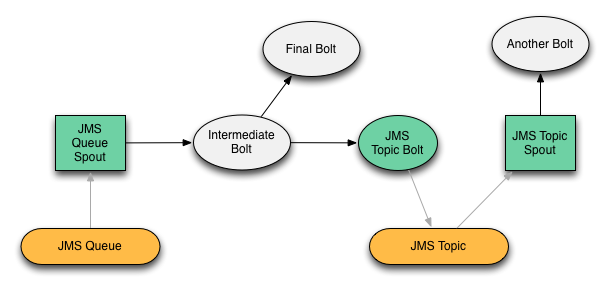

## Example Storm JMS Topology

The storm-jms source code contains an example project (in the "examples" directory) 
builds a multi-bolt/multi-spout topology (depicted below) that uses the JMS Spout and JMS Bolt components.

The green components represent instances of the storm-jms components. White components represent
"standard" Storm bolts (in the example these bolts are instances of `GenericBolt` which simply logs 
information about the tuples it receives and emits).

Grey arrows represent JMS messages, while black arrows represent the flow of Storm tuple objects.

### JMS Transactions and Gauranteed Processing
The example is set up to be "transactional," meaning the JMS Spout will use Storm's guranteed 
processing capabilities to determine if a JMS Message should be acknowledged. Each bolt in the 
topology will anchor to each tuple it receives. If every bolt successfully processes and acks
each tuple in the chain, the original JMS Message will be acknowledged, and the underlying
JMS implementation will not attempt re-delivery of the message. If a bolt fails to process/ack
a tuple, the JMS message will not be acknowledged, and the JMS implementation will queue the 
message for redelivery.

### Data Flow
The topology contains two chains: One originating from a JMS Spout connected to a Queue, and 
another originating from a JMS Spout connected to a Topic.

**Chain #1**

1. The "JMS Queue Spout" receives a JMS Message object from the queue, and emits a
tuple to the "Intermediate Bolt"
2. The "Intermediate Bolt" emits a tuple to the "Final Bolt" and the "JMS Topic Bolt", and acks
the tuple it recieved.
3. The "Final Bolt" receives the tuple and simply acks it, it does not emit anything.
4. The "JMS Topic Bolt" receives a tuple, constructs a JMS Message from the tuple's values, 
and publishes the message to a JMS Topic.
5. If the "JMS Topic Bolt" successfully publishes the JMS message, it will ack the tuple.
6. The "JMS Queue Spout" will recieve notification if all bolts in the chain have acked 
and acknowledge the original JMS Message. If one or more bolts in the chain fail to ack a tuple, the 
"JMS Queue Spout" will not acknowledge the JMS message.

**Chain #2**

1. The "JMS Topic Spout" receives a JMS message from the topic and emits a tuple to "Another Bolt."
2. The "Another Bolt" receives and acks the tuple.
3. The "JMS Topic Spout" acknowledges the JMS message.

### Building the Example Topology

	$ cd storm-jms
	$ mvn clean install

### Running the Example Topology Locally

The example uses ApacheMQ 5.4.0 for JMS. Download and install it from 
[Apache ActiveMQ Downloads](http://activemq.apache.org/download.html).

There is no specific configuration required, simply start ActiveMQ:

	$ [ACTIVEMQ_HOME]/bin/activemq
	
Run the example topology from the `examples` directory:

	$ mvn exec:java
	
When the topology runs, it will connect to ActiveMQ and the following JMS Destinations will be created:

	backtype.storm.contrib.example.queue
	backtype.storm.contrib.example.topic
	
To publish a message to the `backtype.storm.contrib.example.queue` queue:

1. Open the ActiveMQ Queue admin console: http://localhost:8161/admin/queues.jsp
2. Click the [Send To](http://localhost:8161/admin/send.jsp?JMSDestination=backtype.storm.contrib.example.queue&JMSDestinationType=queue)
link for the `backtupe.storm.example.queue` queue entry.
3. On the "Send a JMS Message" form, select the "Persistent Delivery" checkbox, enter
some text for the message body, and click "Send".

In the terminal you should see the following among the output:

	DEBUG (backtype.storm.contrib.jms.bolt.JmsBolt:183) - Connecting JMS..
	DEBUG (backtype.storm.contrib.jms.spout.JmsSpout:213) - sending tuple: ActiveMQTextMessage {commandId = 5, responseRequired = true, messageId = ID:budreau.home-51286-1321074044423-2:4:1:1:1, originalDestination = null, originalTransactionId = null, producerId = ID:budreau.home-51286-1321074044423-2:4:1:1, destination = queue://backtype.storm.contrib.example.queue, transactionId = null, expiration = 0, timestamp = 1321735055910, arrival = 0, brokerInTime = 1321735055910, brokerOutTime = 1321735055921, correlationId = , replyTo = null, persistent = true, type = , priority = 0, groupID = null, groupSequence = 0, targetConsumerId = null, compressed = false, userID = null, content = null, marshalledProperties = org.apache.activemq.util.ByteSequence@6c27ca12, dataStructure = null, redeliveryCounter = 0, size = 0, properties = {secret=880412b7-de71-45dd-8a80-8132589ccd22}, readOnlyProperties = true, readOnlyBody = true, droppable = false, text = Hello storm-jms!}
	DEBUG (backtype.storm.contrib.jms.spout.JmsSpout:219) - Requested deliveryMode: CLIENT_ACKNOWLEDGE
	DEBUG (backtype.storm.contrib.jms.spout.JmsSpout:220) - Our deliveryMode: CLIENT_ACKNOWLEDGE
	DEBUG (backtype.storm.contrib.jms.spout.JmsSpout:224) - Requesting acks.
	DEBUG (backtype.storm.contrib.jms.example.GenericBolt:60) - [INTERMEDIATE_BOLT] Received message: source: 1:10, stream: 1, id: {-7100026097570233628=-7100026097570233628}, [Hello storm-jms!]
	DEBUG (backtype.storm.contrib.jms.example.GenericBolt:66) - [INTERMEDIATE_BOLT] emitting: source: 1:10, stream: 1, id: {-7100026097570233628=-7100026097570233628}, [Hello storm-jms!]
	DEBUG (backtype.storm.contrib.jms.example.GenericBolt:75) - [INTERMEDIATE_BOLT] ACKing tuple: source: 1:10, stream: 1, id: {-7100026097570233628=-7100026097570233628}, [Hello storm-jms!]
	DEBUG (backtype.storm.contrib.jms.bolt.JmsBolt:136) - Tuple received. Sending JMS message.
	DEBUG (backtype.storm.contrib.jms.example.GenericBolt:60) - [FINAL_BOLT] Received message: source: 2:2, stream: 1, id: {-7100026097570233628=-5393763013502927792}, [Hello storm-jms!]
	DEBUG (backtype.storm.contrib.jms.example.GenericBolt:75) - [FINAL_BOLT] ACKing tuple: source: 2:2, stream: 1, id: {-7100026097570233628=-5393763013502927792}, [Hello storm-jms!]
	DEBUG (backtype.storm.contrib.jms.bolt.JmsBolt:144) - ACKing tuple: source: 2:2, stream: 1, id: {-7100026097570233628=-9118586029611278300}, [Hello storm-jms!]
	DEBUG (backtype.storm.contrib.jms.spout.JmsSpout:251) - JMS Message acked: ID:budreau.home-51286-1321074044423-2:4:1:1:1
	DEBUG (backtype.storm.contrib.jms.spout.JmsSpout:213) - sending tuple: ActiveMQTextMessage {commandId = 5, responseRequired = true, messageId = ID:budreau.home-60117-1321735025796-0:0:1:1:1, originalDestination = null, originalTransactionId = null, producerId = ID:budreau.home-60117-1321735025796-0:0:1:1, destination = topic://backtype.storm.contrib.example.topic, transactionId = null, expiration = 0, timestamp = 1321735056258, arrival = 0, brokerInTime = 1321735056260, brokerOutTime = 1321735056260, correlationId = null, replyTo = null, persistent = true, type = null, priority = 4, groupID = null, groupSequence = 0, targetConsumerId = null, compressed = false, userID = null, content = null, marshalledProperties = null, dataStructure = null, redeliveryCounter = 0, size = 0, properties = null, readOnlyProperties = true, readOnlyBody = true, droppable = false, text = source: 2:2, stream: 1, id: {-710002609757023... storm-jms!]}
	DEBUG (backtype.storm.contrib.jms.spout.JmsSpout:219) - Requested deliveryMode: CLIENT_ACKNOWLEDGE
	DEBUG (backtype.storm.contrib.jms.spout.JmsSpout:220) - Our deliveryMode: CLIENT_ACKNOWLEDGE
	DEBUG (backtype.storm.contrib.jms.spout.JmsSpout:224) - Requesting acks.
	DEBUG (backtype.storm.contrib.jms.example.GenericBolt:60) - [ANOTHER_BOLT] Received message: source: 5:9, stream: 1, id: {-5117078009445186058=-5117078009445186058}, [source: 2:2, stream: 1, id: {-7100026097570233628=-9118586029611278300}, [Hello storm-jms!]]
	DEBUG (backtype.storm.contrib.jms.example.GenericBolt:75) - [ANOTHER_BOLT] ACKing tuple: source: 5:9, stream: 1, id: {-5117078009445186058=-5117078009445186058}, [source: 2:2, stream: 1, id: {-7100026097570233628=-9118586029611278300}, [Hello storm-jms!]]
	DEBUG (backtype.storm.contrib.jms.spout.JmsSpout:251) - JMS Message acked: ID:budreau.home-60117-1321735025796-0:0:1:1:1
	
The topology will run for 2 minutes, then gracefully shut down.

