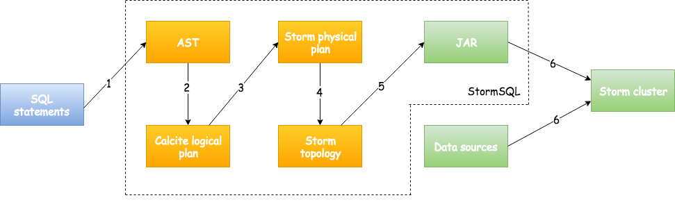
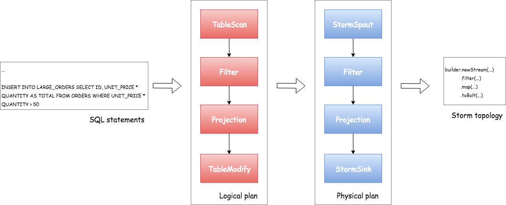

This page describes the design and the implementation of the Storm SQL integration.

## Overview

SQL is a well-adopted yet complicated standard. Several projects including Drill, Hive, Phoenix and Spark have invested significantly in their SQL layers. One of the main design goal of StormSQL is to leverage the existing investments for these projects. StormSQL leverages [Apache Calcite](///calcite.apache.org) to implement the SQL standard. StormSQL focuses on compiling the SQL statements to Storm topologies so that they can be executed in Storm clusters.

Figure 1 describes the workflow of executing a SQL query in StormSQL. First, users provide a sequence of SQL statements. StormSQL parses the SQL statements and translates them to a Calcite logical plan. A logical plan consists of a sequence of SQL logical operators that describe how the query should be executed irrespective to the underlying execution engines. Some examples of logical operators include `TableScan`, `Filter`, `Projection` and `GroupBy`.

<div align="center">


<p>Figure 1: Workflow of StormSQL.</p>
</div>

The next step is to compile the logical execution plan down to a physical execution plan. A physical plan consists of physical operators that describes how to execute the SQL query in *StormSQL*. Physical operators such as `Filter`, `Projection`, and `GroupBy` are directly mapped to operations in Storm topologies. StormSQL also compiles expressions in the SQL statements into Java code blocks and plugs them into the Storm Streams API functions which will be compiled once and executed in runtime.

Finally, StormSQL submits created Storm topology with empty packaged JAR to the Storm cluster. Storm schedules and executes the Storm topology in the same way it executes other Storm topologies.

The following code block shows an example query that filters and projects results from a Kafka stream.

```
CREATE EXTERNAL TABLE ORDERS (ID INT PRIMARY KEY, UNIT_PRICE INT, QUANTITY INT) LOCATION 'kafka://...' ...

CREATE EXTERNAL TABLE LARGE_ORDERS (ID INT PRIMARY KEY, TOTAL INT) 'kafka://...' ...

INSERT INTO LARGE_ORDERS SELECT ID, UNIT_PRICE * QUANTITY AS TOTAL FROM ORDERS WHERE UNIT_PRICE * QUANTITY > 50
```

The first two SQL statements define the inputs and outputs of external data. Figure 2 describes the processes of how StormSQL takes the last `SELECT` query and compiles it down to Storm topology.

<div align="center">


<p>Figure 2: Compiling the example query to Storm topology.</p>
</div>


## Constraints of querying streaming tables

There are several constraints when querying tables that represent a real-time data stream:

* The `ORDER BY` clause cannot be applied to a stream.
* There is at least one monotonic field in the `GROUP BY` clauses to allow StormSQL bounds the size of the buffer.

For more information please refer to http://calcite.apache.org/docs/stream.html.

## Dependency

Storm takes care about necessary dependencies of Storm SQL except the data source JAR which is used by `EXTERNAL TABLE`. 
You can use `--jars` or `--artifacts` option to `storm sql` so that data source JAR can be included to Storm SQL Runner and also Storm Topology runtime classpath.
(Use `--artifacts` if your data source JARs are available in Maven repository since it handles transitive dependencies.)

Please refer [Storm SQL integration](storm-sql.html) page to how to do it.